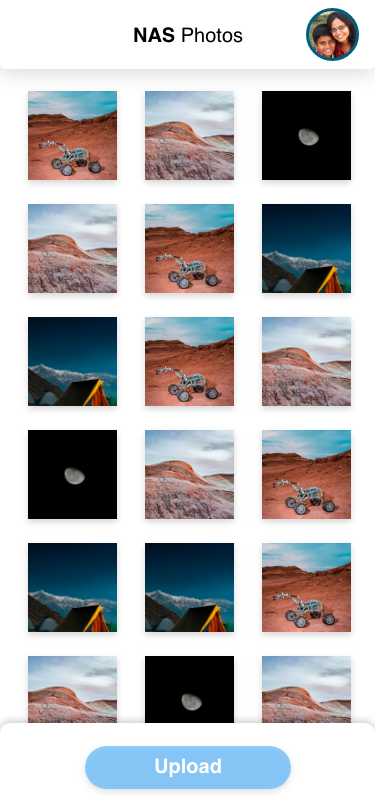

# Photos House NAS

A Flutter project to solve the problem of Google photos now being discontinued for free storage of photos.
This Application uses Wifi router's ftp server function to create a home wireless NAS system to automatically upload and download photos from the camera folder of the phone.

## FTP DART IMPLENTATION

## HOW DOE IT WORK
The Application constantly watches a directory for new images and deletion. It updates the list of image names and upload and deletes the photos form the ftp server.

## ISSUES
Unable to preview ftp images using flutter's network image plugin inside the app.
